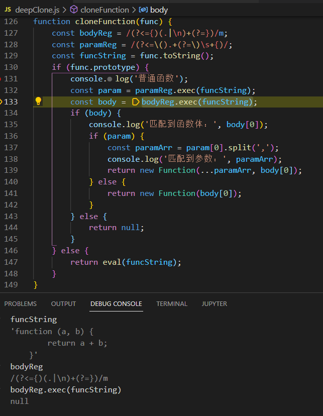
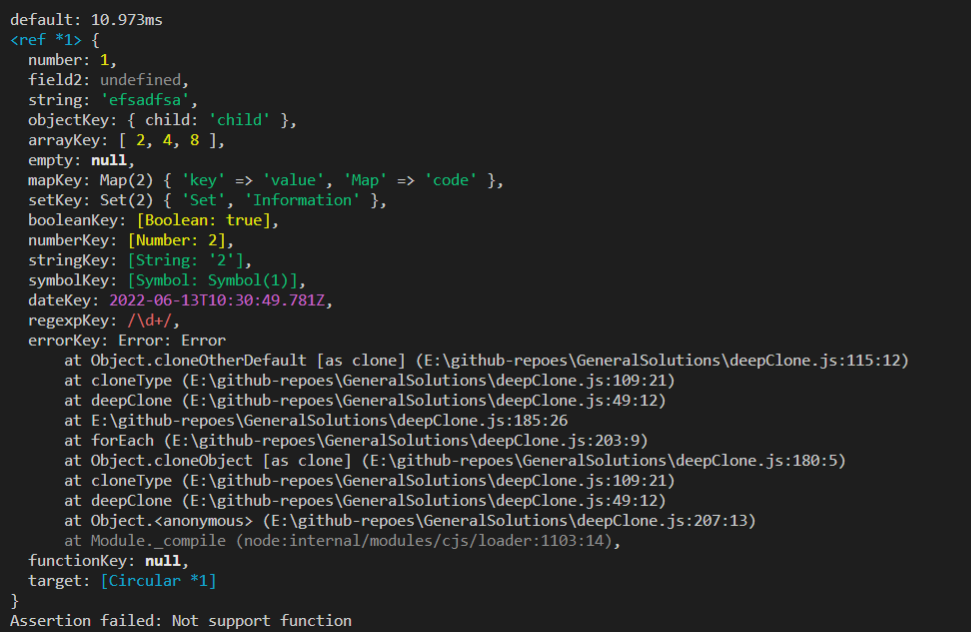

关于本专辑

这里整理一些常规实现。

1. 深拷贝-`deepClone.js`

本部分代码是在[如何写出一个惊艳面试官的深拷贝? - 掘金](https://juejin.cn/post/6844903929705136141)基础上的一点重构，以及加入了自动console.assert代码。

目前发现利用正则表达式拷贝普通函数的方法在Node16.14.0环境下不成功，chrome下可以通过。
分析原因后，发现是windows上面对于换行符的识别问题导致。改进：在正则表达式部分添加`|\r\n`.

2. 遍历性能测试-`speedTest-loop.js`

